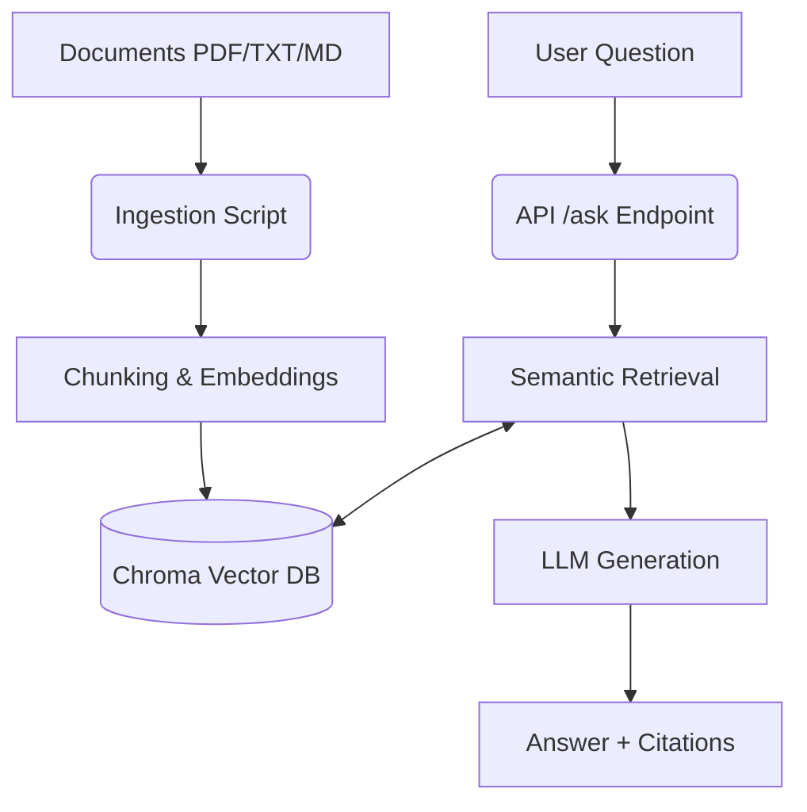

# ResearchPilot — AI Research & Intelligence Assistant

ResearchPilot is an intelligent agentic workflow application designed to assist with deep research, information retrieval, and synthesis. It uses RAG (Retrieval-Augmented Generation) and LangChain to provide insightful answers grounded in retrieved documents.

## Current Capabilities
* Basic project structure established.
* FastAPI setup for health monitoring and simple API entrypoints.
* Environment configuration management using Pydantic Settings.
* Base dependencies configured for future integration.

## Planned Architecture
* **Vector Storage**: ChromaDB for document embeddings.
* **LLM Orchestration**: LangChain for chaining, RAG, and agentic workflows.
* **API Layer**: FastAPI for serving the application.
* **Frontend**: A simple UI (planned) for interacting with the AI.

## Tech Stack
* Python 3
* FastAPI & Uvicorn
* LangChain
* Pydantic
* Pytest

## Project Structure
```
researchpilot/
├── app/             # Main application code (FastAPI, config, logic)
├── data/            # Data storage (documents, chroma DB)
├── docs/            # Documentation (Walkthroughs, etc.)
├── scripts/         # Utility scripts
├── tests/           # Pytest unit and integration tests
├── .env.example     # Template for environment variables
├── requirements.txt # Python dependencies
└── run.py           # Entry point for running the application
```

## V1 Capabilities (Document-based RAG)
ResearchPilot currently implements a Document-based Retrieval-Augmented Generation (RAG) system:
- **Ingestion**: Supports loading PDF, Markdown, and TXT files, chunking them, and generating embeddings.
- **Vector Storage**: Uses ChromaDB for local, fast semantic search.
- **Retrieval**: Retrieves the most relevant document chunks based on a user's query.
- **Question Answering**: Uses Google Gemini to answer questions strictly based on the retrieved context, citing its sources.

### Architecture


## Installation Instructions

1. Clone the repository.
2. Create a virtual environment:
   ```bash
   python -m venv .venv
   ```
3. Activate the virtual environment:
   * Windows: `.venv\Scripts\activate`
   * Unix/macOS: `source .venv/bin/activate`
4. Install dependencies:
   ```bash
   pip install -r requirements.txt
   ```

## Environment Variables
Copy `.env.example` to `.env` and fill in your values.
```bash
cp .env.example .env
```
## Roadmap

- [x] **V0:** Project Setup & Core Configuration
- [x] **V1:** Document-based RAG pipeline (PDF, Markdown, TXT)
- [x] **V2:** Web Search via LangChain Tools (DuckDuckGo integration)
- [x] **V3:** Autonomous AI Agent orchestration (LangGraph)
- [x] **V4:** Advanced RAG techniques (Reranking, Query Expansion)
- [ ] **V5:** Agentic Evaluation & Tracing

---

## Usage

### 1. Ingest Documents (V1)
Place any `.txt`, `.md`, or `.pdf` files into the `data/documents/` folder.
Run the ingestion script to chunk and vectorize them into ChromaDB:

```bash
python scripts/ingest.py
```

### 2. Run the API Server
Start the FastAPI application:

```bash
uvicorn app.main:app --reload
```

### 3. Query the Endpoints

**Ask a Document Question (V1 RAG):**
```bash
curl -X POST http://localhost:8000/api/v1/ask \
     -H "Content-Type: application/json" \
     -d '{"question": "What is ResearchPilot?"}'
```

**Perform Web Research (V2 Tool-Calling):**
```bash
curl -X POST http://localhost:8000/api/v2/research \
     -H "Content-Type: application/json" \
     -d '{"question": "What is the latest news regarding AI models today?"}'
```

**Run Autonomous Agent (V3 LangChain Agent):**
```bash
curl -X POST http://localhost:8000/api/v3/research \
     -H "Content-Type: application/json" \
     -d '{"question": "What is the latest news regarding AI models today?"}'
```

**Generate Citation-Backed Research Report (V4):**
```bash
curl -X POST http://localhost:8000/api/v4/report \
     -H "Content-Type: application/json" \
     -d '{"question": "What are the core components of the RAG system described in the uploaded documents?"}'
```
**V4 Expected Output Schema:**
```json
{
  "question": "What are the core components of the RAG system...",
  "executive_summary": "The RAG system comprises...",
  "key_findings": ["...", "..."],
  "detailed_analysis": "The RAG system is built around... [1]",
  "sources": [
    {
      "title": "dummy.txt",
      "url_or_id": "dummy.txt",
      "source_type": "document",
      "metadata": {"snippet": "..."}
    }
  ],
  "limitations": "The evidence does not provide details about..."
}
```

---

## Available Tools

**Web Search (`web_search_tool`)**
- Provider: DuckDuckGo (`duckduckgo-search`)
- Usage: Allows the system to query the live internet for recent facts, news, and external context that is not present in the internal document database.

**Document Search (`document_search_tool`)**
- Provider: ChromaDB (Local)
- Usage: Allows the agent to query uploaded proprietary documents. Exposed as a standard LangChain tool so the agent can autonomously decide when internal context is needed.

## Citation Design (V4)
LLM-generated citations can be highly unreliable and prone to hallucination (e.g. inventing URLs). ResearchPilot solves this by:
1. Intercepting the raw evidence from the Agent Tools *before* the final report generation.
2. Normalizing and deduplicating the actual URLs/filenames into a verified list of `ReportSource`s.
3. Forcing the LLM (using LangChain's `.with_structured_output()`) to pick from our pre-validated `sources` array and cite them using `[id]` mapping.
This physically prevents the LLM from hallucinating fake source links!

## How to Run Tests
```bash
pytest
```

## Development Roadmap

### V0: Initial Setup
- [x] Project scaffolding and virtual environment setup
- [x] Core configuration via Pydantic Settings
- [x] FastAPI skeleton and API router setup

### V1: Document-based RAG
- [x] Implement document ingestion and text chunking
- [x] Integrate ChromaDB vector storage and Google Gemini embeddings
- [x] Build retrieval and augmented generation service
- [x] Create POST `/api/v1/ask` endpoint

### V2: Tool-Calling Architecture
- [x] Integrate LangChain Tool schema
- [x] Implement DuckDuckGo Search Provider abstraction
- [x] Develop LLM execution loop for conditional tool invocation
- [x] Create POST `/api/v2/research` endpoint

### V2.1: Provider Abstraction
- [x] Integrate LangChain models for Groq, OpenAI, Anthropic, and HuggingFace
- [x] Build multi-provider LLM factory (`app/core/llm.py`)
- [x] Move to HuggingFace Inference API for Embeddings (`app/core/embeddings.py`)

### V3: Autonomous AI Agent
- [x] Convert Document RAG to a LangChain tool (`app/tools/rag_search.py`)
- [x] Develop centralized System Prompt (`app/prompts.py`)
- [x] Replace manual LLM loop with `create_agent` from LangChain
- [x] Create POST `/api/v3/research` endpoint

### V4: Citation-Backed Research Reports
- [x] Integrate LangChain `.with_structured_output()` for Pydantic schema generation
- [x] Build `ReportService` to intercept and normalize raw tool outputs (evidence)
- [x] Deduplicate gathered sources and prevent LLM URL hallucination
- [x] Create POST `/api/v4/report` endpoint

### V5: Advanced Agentic Routing (LangGraph)
- [ ] Transition from standard Agent to stateful LangGraph
- [ ] Implement explicit routing edges to handle tool failures (e.g. DDG blocking)
- [ ] Support human-in-the-loop approvals for complex research
