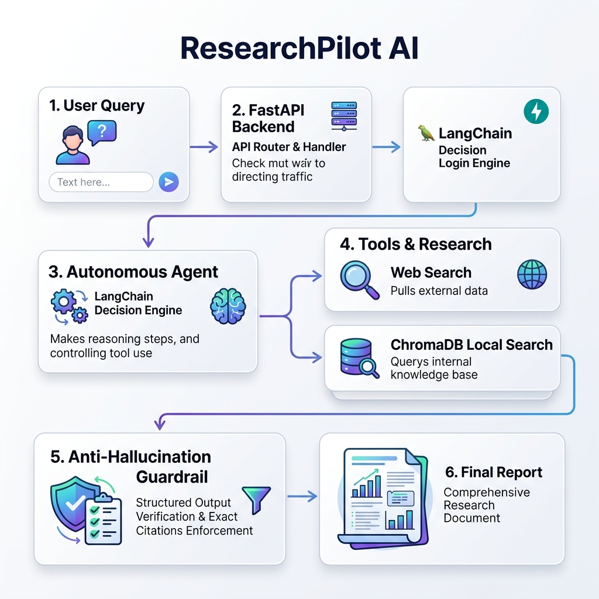

# ResearchPilot — Autonomous AI Research Agent

ResearchPilot is an intelligent agentic workflow application designed to assist with deep research, information retrieval, and synthesis. It dynamically routes user queries between a local RAG (Retrieval-Augmented Generation) pipeline and live web search to produce highly accurate, citation-backed research reports.

## Problem Statement
Standard LLMs hallucinate facts and links when asked complex research questions. Even traditional RAG systems often fail if the internal document database lacks the answer. ResearchPilot solves this by giving the LLM agency—allowing it to autonomously decide whether to search internal documents via ChromaDB, search the live web via DuckDuckGo, or both, before synthesizing a rigorously grounded report.

## Key Features
- **Autonomous Tool Routing:** LangChain agents dynamically select the right tool (Document Search vs. Web Search) based on the user's prompt.
- **Local RAG Pipeline:** Ingests PDF, TXT, and Markdown files into a local ChromaDB instance using HuggingFace embeddings.
- **Anti-Hallucination Guardrails:** Intercepts raw tool outputs and forces the LLM to output a Pydantic schema using strict `[id]` citations mapped to verified sources.
- **Deterministic Evaluation Suite:** Measures Recall@K and Precision@K, and utilizes an LLM-as-a-judge to score groundedness and relevance.
- **FastAPI Backend:** Fully typed, asynchronous REST API with auto-generated OpenAPI docs.

## Architecture



## Tech Stack
* **Language:** Python 3.11
* **API Framework:** FastAPI, Uvicorn
* **AI & Agents:** LangChain, Groq API (LLaMA/Mixtral)
* **Embeddings:** HuggingFace Inference API
* **Vector DB:** ChromaDB (Local SQLite)
* **Frontend Demo:** Streamlit
* **Testing:** Pytest

## Project Structure
```text
researchpilot/
├── app/             # Main FastAPI application and Agent services
├── data/            # Data storage (documents, chroma DB, evaluation sets)
├── demo/            # Streamlit UI demo
├── docs/            # Technical documentation and interview prep
├── scripts/         # Utility scripts (ingestion, evaluation)
├── tests/           # Pytest unit and integration tests
├── Dockerfile       # Containerization
└── requirements.txt # Python dependencies
```

## Setup Instructions

### 1. Clone the repository
```bash
git clone https://github.com/Altaf-7/ResearchPilot.git
cd ResearchPilot
```

### 2. Create a virtual environment
```bash
python -m venv .venv
# Windows:
.venv\Scripts\activate
# Unix/macOS:
# source .venv/bin/activate
```

### 3. Install dependencies
```bash
pip install -r requirements.txt
```

### 4. Configure Environment
Copy the example environment file and add your API keys.
```bash
cp .env.example .env
```
*You must add your `GROQ_API_KEY` to the `.env` file.*

### 5. Add Documents & Ingest
Place any `.txt`, `.md`, or `.pdf` files into the `data/documents/` folder. Then, build the local vector database:
```bash
python scripts/ingest.py
```

## Usage

### 1. Run the API Server
Start the FastAPI backend:
```bash
uvicorn app.main:app --reload
```
You can view the interactive API documentation by navigating to `http://localhost:8000/docs` in your browser.

### 2. Run the Streamlit Demo (Recommended)
In a separate terminal, start the UI:
```bash
streamlit run demo/app.py
```
This provides a clean interface to ask questions, view the generated Markdown report, and inspect the cited sources.

### 3. API Endpoints

**Health Check:**
```bash
curl http://localhost:8000/health
```

**Generate Research Report:**
```bash
curl -X POST http://localhost:8000/api/research \
     -H "Content-Type: application/json" \
     -d '{"question": "What is ResearchPilot?"}'
```

## Evaluation Pipeline
ResearchPilot includes a deterministic evaluation pipeline to measure retrieval and generation quality against a version-controlled dataset (`data/evaluation/dataset.json`).

**How to Run Evaluation:**
```bash
python scripts/evaluate.py
```
*(Note: Ensure your `.env` is configured with a valid API key, as the script uses the LLM to score the generation metrics. Rate limits may apply for large datasets.)*

## Design Decisions & Limitations
- **Local Vector DB:** ChromaDB is run in-memory/SQLite mode. This is perfect for a portfolio project but would need to be migrated to a standalone Chroma container or managed service (Pinecone) for scalable production.
- **Tool Loops:** Small open-source models occasionally get stuck in infinite loops if a tool (like DuckDuckGo) returns an empty array.
- **API Rate Limits:** The multi-stage agent loop requires sequential network calls to the LLM provider, which can trigger rate limits on free-tier accounts.

## Future Improvements
- **LangGraph Integration:** Transitioning from the legacy `AgentExecutor` to a stateful LangGraph to explicitly handle tool failure edges and prevent infinite loops.
- **Reranking:** Adding a Cross-Encoder to rerank ChromaDB results for higher Precision@K.
